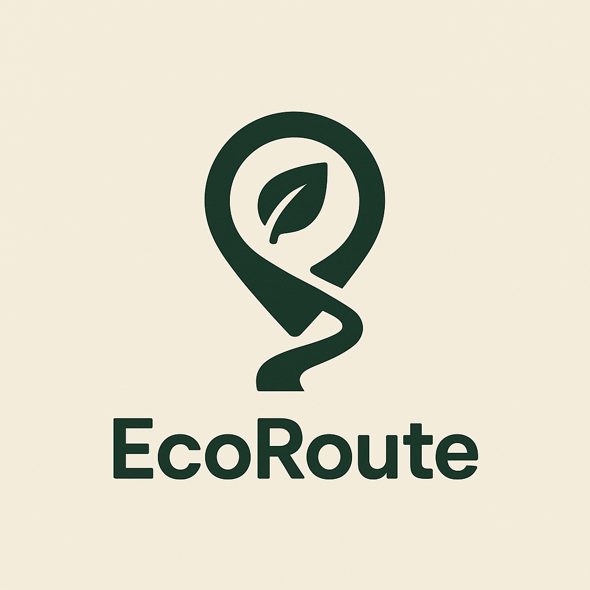

<h1 align="center">🌿 EcoRoute</h1>
<p align="center"><em>Smart & Sustainable Route Planner</em></p>
<p align="center">
  
</p>

<p align="center">
  <a href="#"></a>
  <a href="#"></a>
  <a href="#"></a>
  <a href="#"></a>
  <a href="#"></a>
</p>

---

**EcoRoute** is an AI-powered platform that helps users plan the most efficient, safe, and environmentally conscious travel routes. Designed for the **Code for Bharat Hackathon** under the theme **Sustainable Tech & Climate Innovation**, it combines live weather tracking, carbon emission estimation, and route optimization to promote eco-friendly travel across India.

---

## 🧠 Problem Statement: Sustainable Tech & Climate Innovation

India’s transportation sector contributes significantly to air pollution and CO₂ emissions. Daily travel—whether for work, tourism, or logistics—is often inefficient, with users unaware of safer or greener route options.

There is a growing need for intelligent tools that:
- Reduce the environmental impact of travel
- Provide real-time data (weather, safety)
- Encourage eco-conscious decisions

---

## ✅ Our Solution: EcoRoute

**EcoRoute** empowers users to:
- 🧭 Plan optimal travel routes with **custom checkpoints**
- ⏱️ Set **rest intervals** and get safe stop suggestions
- 🌦️ Receive **real-time weather updates** along the journey
- 🚗 Get **transport mode recommendations**
- ♻️ View **carbon emission estimates** for each trip
- 📊 Analyze **CO₂ history and trip summaries** via dashboards

---

## 🛠️ Tech Stack

| Frontend        | Backend           | APIs & Services              |
|-----------------|-------------------|------------------------------|
| React.js (Vite) | Node.js           | Geoapify API (Geocoding)     |
| Tailwind CSS    | Express.js        | OpenWeather API (Weather)    |
| DaisyUI         | MongoDB (if used) | Climatiq API (CO₂ emissions) |
| Framer Motion   | CORS Middleware   |                              |
| Axios           | dotenv            |                              |

---

## 🌐 APIs Used

| API             | Purpose                       |
|----------------|-------------------------------|
| Geoapify API    | Geocoding & Reverse Geocoding |
| OpenWeather API | Real-time weather updates     |
| Climatiq API    | CO₂ emission estimation       |

---

## 📦 Project Structure

```
code-for-bharat-ecoRoute/
├── client/   # Frontend (React + Vite + TailwindCSS)
├── server/   # Backend (Node.js + Express)
├── README.md # Project overview (this file)
```

- 📁 `client/` – React-based frontend with Vite, TailwindCSS, DaisyUI, Framer Motion  
- 📁 `server/` – Node.js + Express backend with integrated APIs

➡️ [Frontend Setup Guide](./client/README.md)  
➡️ [Backend Setup Guide](./server/README.md)

---

## 🏗️ System Architecture

```
graph TD

  A[User Input (Web App)] --> B[Frontend (React + Redux)]
  B --> C[Backend API (Node.js)]
  C --> D[Database (MongoDB or PostgreSQL)]
  C --> E[OpenWeatherMap API]
  C --> F[Climatiq API (Carbon Emission Logic)]
```

## ⚡ Quick Start
### 📌 Clone the repository

```bash
git clone https://github.com/DheerajRay-01/code-for-bharat-ecoRoute.git
cd code-for-bharat-ecoRoute
```

---

### 🌐 Setup Instructions

#### 🔥 Frontend (Client)

For running the frontend, follow the guide here:
➡️ [Frontend Setup Guide](./client/README.md)

#### 🔥 Backend (Server)

For running the backend, follow the guide here:
➡️ [Backend Setup Guide](./server/README.md)

## 👥 Hackathon Team
| Name           | GitHub                                             |
|----------------|----------------------------------------------------|
| Sujal Panchal  | [@sujal-dev24](https://github.com/sujal-dev24)     |
| Upma Mishra    | [@upma-dev](https://github.com/upma-dev)           |
| Saumya Tandon  | [@Selenecoder](https://github.com/Selenecoder)     |
| Dheeraj Ray    | [@DheerajRay-01](https://github.com/DheerajRay-01) |

## 🤝 Contribution
We welcome contributions!
Fork the repo, make changes, and open a pull request 🚀

## 📄 License
This project is licensed under the MIT License
for hackathon and personal learning use.
